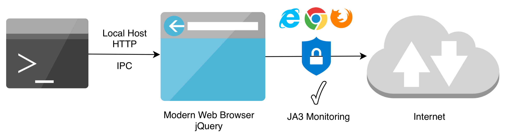
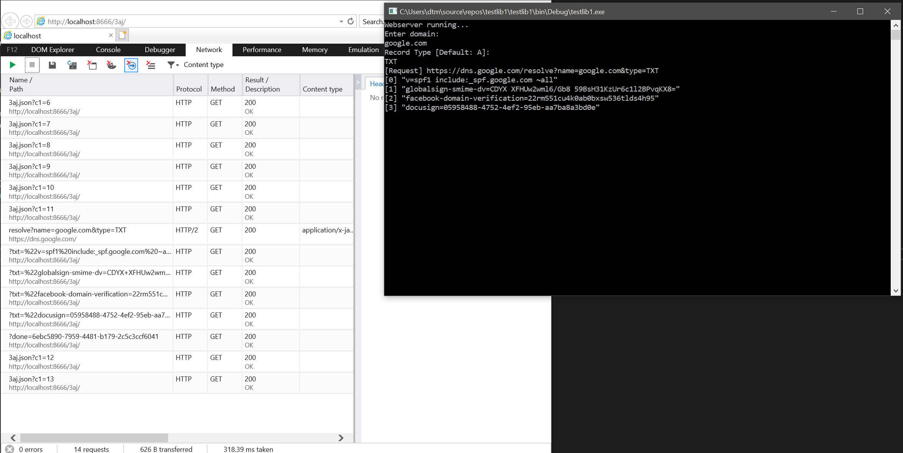
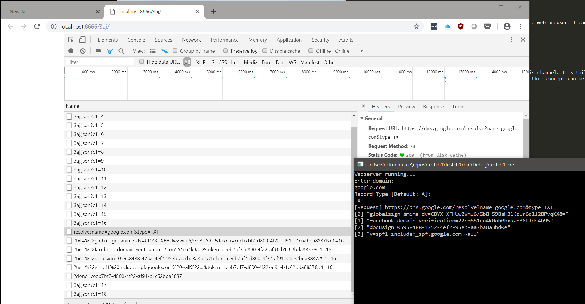

# 3ajlib

A proof of concept that demonstrates a method of sending/receiving data from .NET via a legitimate browser process of your choosing.

## Introduction

There are situations where a red teamer may want to have more control over the specific origin of their traffic on a system. Defensive tools such as [JA3](https://github.com/salesforce/ja3) and other EDR product components can identify known bad and contribute to building up a risk score based on the aspects of the web client being used to send data. I played around with JA3 and looked at the results for some of the typical web clients that are used a .NET red teamers world. On the whole there was nothing too alarming, since lots of legitimate software uses the same methods. That said a JA3 hash of a client can contribute to a wider mechanism/set of metrics for filtering/determing a risk score for connections. So I set out thinking of a way I can control which client sends data and where better to start than a legitimate web browser or in fact any of them.

## Idea

I can set up a sort of local IPC over HTTP between .NET and a web browser. I can then use JavaScript to handle a) communications outbound b) communications to my software.

In an attack scenario this would look something like this:

## What does this proof of concept do?

This proof of concept introduces a library which sets up this channel. It's tailored towards my work on [DoHC2](https://github.com/SpiderLabs/DoHC2) and currently the test client does DNS resolution via Google's DNS over HTTPS endpoint. In reality this concept can be extended to talk to any endpoint which presents a 'Access-Control-Allow-Origin' header which permits the localhost endpoint used.

## Demo

Demo showing DNS over HTTPS resolution via Internet Explorer:

Demo showing DNS over HTTPS resolution via Chrome:

## Authors

* **David Middlehurst** - Twitter- [@dtmsecurity](https://twitter.com/dtmsecurity)

## License

MIT

## Acknowledgments

* [Simple C# Web Server](https://codehosting.net/blog/BlogEngine/post/Simple-C-Web-Server)